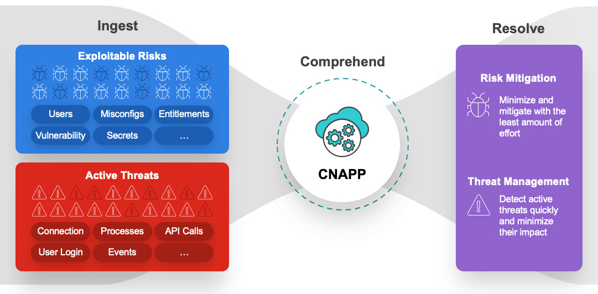
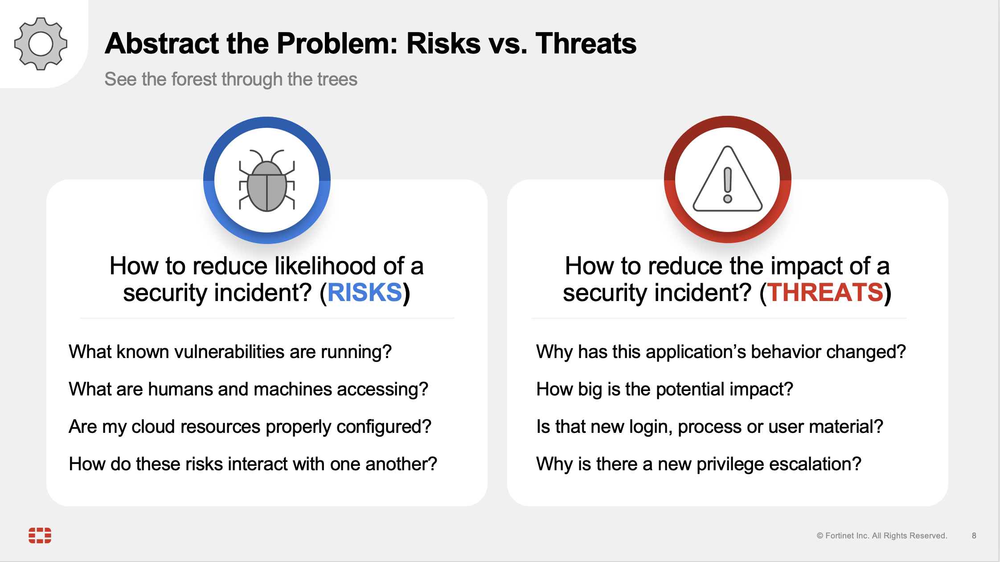
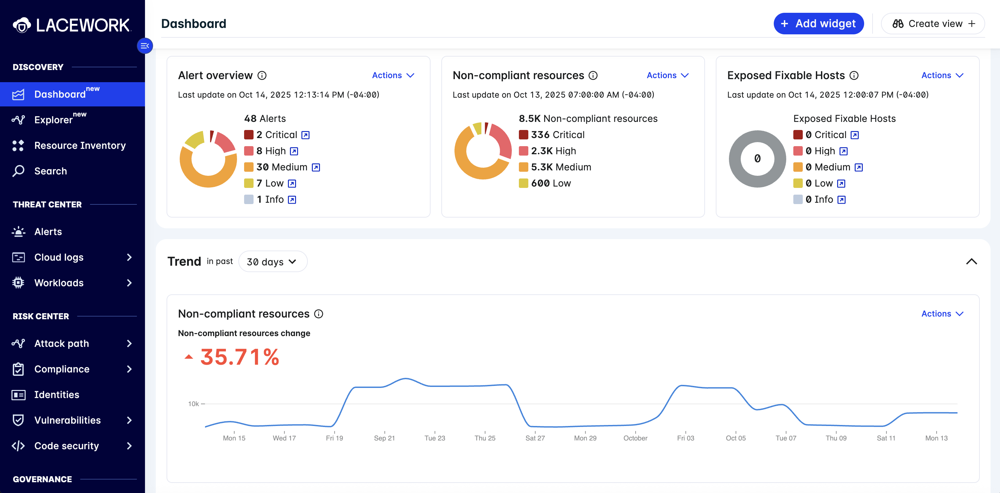
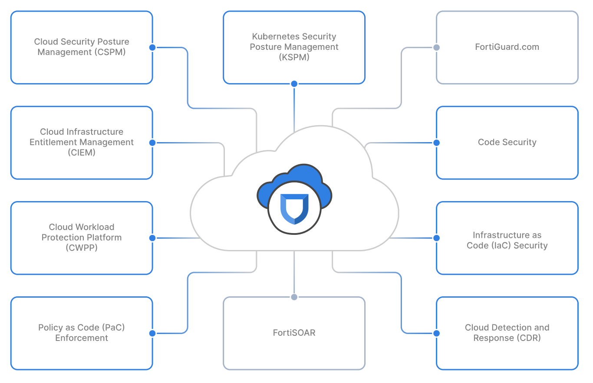

## Introduction 

What is CNAPP? A Cloud-Native Application Protection Platform (CNAPP) is a unified security solution designed to protect cloud applications and their infrastructure throughout the entire development lifecycle. It consolidates multiple, traditionally separate security tools into a single platform, including capabilities like vulnerability scanning, cloud security posture management (CSPM), and runtime threat detection. This integrated approach provides a comprehensive view of risks, helping organizations to "shift left" by identifying and fixing security issues earlier in the development process and improving collaboration between security and development teams. Ultimately, CNAPPs simplify security operations and enhance an organization's overall cloud security posture.

The core capability of the FortiCNAPP platform is the ability to highlight and differentiate between Risk and Threats. Identifying Risks before they can be exploited by a Threat is a key tenet of any security program.

##### What is a Risk?
Risks are ostensibly the result of human behavior - sometimes our inaction, and other times the result of incorrect action. Risks include misconfigurations in common cloud services, exposed secrets in source code management tools, overly provisioned IAM identities, and vulnerable operating system software. 

##### What is a Threat?
Threats are any direct or indirect action taken that's meant to exploit or leverage a risk to do bad things. Threats can be human entities, commonly referred to as "threat actors," and can be state sponsored, part of an independent collective group, contract-for-hire, or solo opportunists. Threats can also be non-human, i.e. bots, web scrapers, automated fuzzers, etc. In the age of AI, the latter has become an ever-increasing concern by the day. 

Whether a threat is human or non-human, it's imperative to be able to detect the bread crumbs left behind in any type of breach scenario. In this course, we'll examine how to use FortiCNAPP to identify risks early on and investigate threats before irrevocable harm can occur. 

#### The Big Data Problem

FortiCNAPP (formerly Lacework) was purpose-built to solve some fundamental challenges with Cloud Security as organizations expanded beyond their on-premise and into cloud service providers like Amazon Web Services, Microsoft Azure, and Google Cloud. The proliferation of the Cloud as scalable, cost-efficient compute and managed application services led to the following patterns:

1. Organizations moving to the Cloud expected their on-premise tools to migrate seamlessly. (Hint, they did not). Legacy tools were not built for dynamic cloud environments. They would eventually offer cloud-compatible connectors to import data from the cloud environment, but they weren't built for detecting cloud-based attacks and evaluating compliance controls (in the cloud). 

2. Accordingly, organizations turned to the multitude of point solutions to check the box for Cloud User Activity, Compliance, Container Security, Workload Monitoring, Vulnerability Detection, Entitlement Management... Well, you get the point. Tools were abundant, which created a context-switching problem that put a stress on security teams. The lack of a unified solution for all of this tooling meant an increase in time-to-detection and time-to-remediation.

#### The Solution

FortiCNAPP is a next-generation cloud security solution built for collecting and correlating all of the data that clouds generate to builds relationships between users, resources, applications, machines and processes, and baselines and tracks the interactions between those relationships using the patented **Polygraph Data Platform**. 

#### The Fortinet Fabric
FortiCNAPP can integrate with other Fortinet tools to empower cloud security teams, network engineers, and devops professionals to tackle security initiatives more effectively. FortiCNAPP can now integrate with:

-**FortiGate VM** in AWS for attack path visualization

-**FortiAnalyzer** for log aggregation

-**FortiSIEM** for alert correlation

-**FortiSOAR** for incident response alerting and automated remediation

We'll examine these integrations later on in the course. For now, on to the next module!

